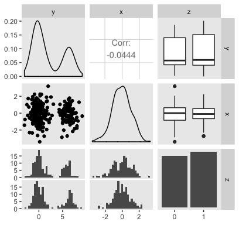
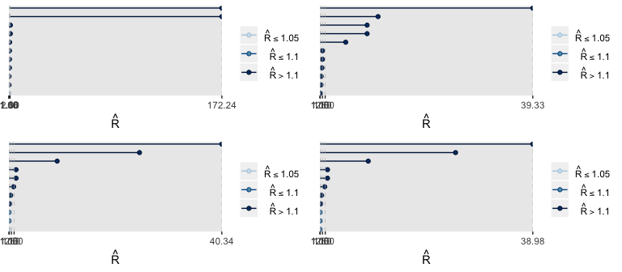
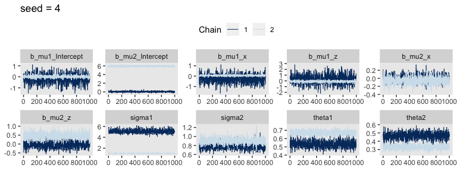
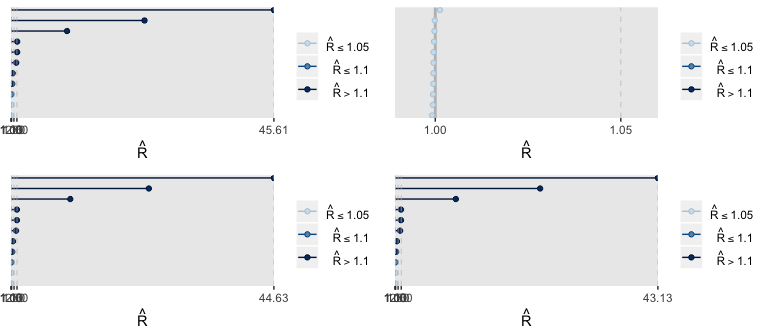
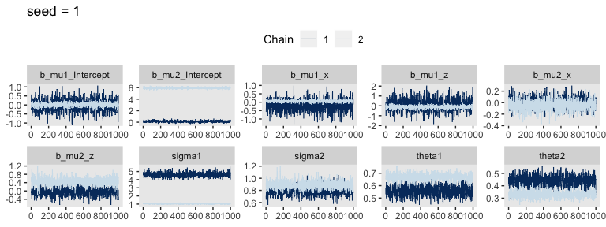
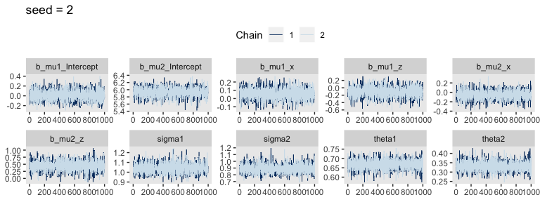

brms reference manual examples
================
A Solomon Kurz
2019-01-08

These are taken from the `mixture` section of the [brms reference manual](https://cran.r-project.org/web/packages/brms/brms.pdf).

We need data
------------

Here we simulate our data, `dat`.

``` r
library(tidyverse)

set.seed(1234)
dat <- 
  tibble(y = c(rnorm(200, mean = 0, sd = 1), 
               rnorm(100, mean = 6, sd = 1)),
         x = rnorm(300, mean = 0, sd = 1),
         z = sample(0:1, 300, replace = T))

head(dat)
```

    ## # A tibble: 6 x 3
    ##        y       x     z
    ##    <dbl>   <dbl> <int>
    ## 1 -1.21  -0.580      1
    ## 2  0.277 -0.953      0
    ## 3  1.08  -0.179      1
    ## 4 -2.35   1.01       0
    ## 5  0.429  0.0236     0
    ## 6  0.506 -0.649      1

Here's what the data look like.

``` r
library(GGally)
theme_set(theme_grey() +
            theme(panel.grid = element_blank()))

dat %>% 
  mutate(z = factor(z)) %>% 
  
  ggpairs()
```



`fit1`: A simple normal mixture model
-------------------------------------

Open brms.

``` r
library(brms)
```

Fit the model.

``` r
get_prior(data = dat,
      family = mixture(gaussian, gaussian),
      bf(y ~ x + z))
```

    ## Setting order = 'mu' for mixtures of the same family.

    ##                  prior     class coef group resp dpar nlpar bound
    ## 1  student_t(3, 0, 10)    sigma1                                 
    ## 2  student_t(3, 0, 10)    sigma2                                 
    ## 3                          theta                                 
    ## 4       logistic(0, 1)    theta1                                 
    ## 5       logistic(0, 1)    theta2                                 
    ## 6                              b                  mu1            
    ## 7                              b    x             mu1            
    ## 8                              b    z             mu1            
    ## 9  student_t(3, 1, 10) Intercept                  mu1            
    ## 10                             b                  mu2            
    ## 11                             b    x             mu2            
    ## 12                             b    z             mu2            
    ## 13 student_t(3, 1, 10) Intercept                  mu2

``` r
fit1_s1 <- 
  brm(data = dat,
      family = mixture(gaussian, gaussian),
      bf(y ~ x + z),
      prior = c(prior(normal(0, 7), Intercept, dpar = mu1),
                prior(normal(5, 7), Intercept, dpar = mu2)), 
      iter = 2000, warmup = 1000, chains = 2, cores = 2,
      seed = 1)

fit1_s2 <-
  update(fit1_s1,
         seed = 2)

fit1_s3 <-
  update(fit1_s1,
         seed = 3)

fit1_s4 <-
  update(fit1_s1,
         seed = 4)
```

If you'd like to inspect all those chains, you can use the `plot()` funciton, as usual. Since we're working in bulk, it might make sense to condense our diagnostics to $\\hat R$ plots via the [bayesplot package](http://mc-stan.org/bayesplot/).

``` r
library(bayesplot)
library(gridExtra)

p1 <-
  rhat(fit1_s1) %>% 
  mcmc_rhat()

p2 <-
  rhat(fit1_s2) %>% 
  mcmc_rhat()

p3 <-
  rhat(fit1_s3) %>% 
  mcmc_rhat()

p4 <-
  rhat(fit1_s4) %>% 
  mcmc_rhat()

grid.arrange(p1, p2, p3, p4, ncol = 2)
```



Recall we like our $\\hat R$ values to hover around 1. For the models from each seed, those are just a disaster. Let's take a peek at the chains from just two of the fits to get a sense of the damage.

``` r
posterior_samples(fit1_s1, add_chain = T) %>% 
  select(-lp__, -iter) %>% 
  mcmc_trace(facet_args = list(ncol = 5)) +
  ggtitle("seed = 1") +
  theme(legend.position = "top")
```


``` r
posterior_samples(fit1_s4, add_chain = T) %>% 
  select(-lp__, -iter) %>% 
  mcmc_trace(facet_args = list(ncol = 5)) +
  ggtitle("seed = 4") +
  theme(legend.position = "top")
```



Where as many of the chains in `fit1_s1` appeared to wildly meander across the parameter space, The parallel chains in `fit1_s4` seemed to stabilize on alternative parameter spaces. I believe this is often called the label switching problem (e.g., see [here](http://stephenslab.uchicago.edu/assets/papers/Stephens2000b.pdf)). Either way, the resulting $\\hat R$ values were awful.

For our first attempt at fixing the issue, we might tighten up the priors. Of our three variables, two are standardized and the third is a dummy. It wouldn't be unreasonable to *σ* = 1 Gaussians on all intercepts, *β*s, and even the model *σ*s themselves.

``` r
fit1_s1 <- 
  brm(data = dat,
      family = mixture(gaussian, gaussian),
      bf(y ~ x + z),
      prior = c(prior(normal(0, 1), Intercept, dpar = mu1),
                prior(normal(5, 1), Intercept, dpar = mu2),
                prior(normal(0, 1), class = b, dpar = mu1),
                prior(normal(0, 1), class = b, dpar = mu2),
                prior(normal(0, 1), class = sigma1),
                prior(normal(0, 1), class = sigma2)), 
      iter = 2000, warmup = 1000, chains = 2, cores = 2,
      seed = 1)

fit1_s2 <-
  update(fit1_s1,
         seed = 2)

fit1_s3 <-
  update(fit1_s1,
         seed = 3)

fit1_s4 <-
  update(fit1_s1,
         seed = 4)
```

Check the $\\hat R$ values.

``` r
p1 <-
  rhat(fit1_s1) %>% 
  mcmc_rhat()

p2 <-
  rhat(fit1_s2) %>% 
  mcmc_rhat()

p3 <-
  rhat(fit1_s3) %>% 
  mcmc_rhat()

p4 <-
  rhat(fit1_s4) %>% 
  mcmc_rhat()

grid.arrange(p1, p2, p3, p4, ncol = 2)
```



They only look good for 1 on 4. Not very encouraging. Let's revisit the chains for `seed = 1` and now inspect the better-looing `seed = 2`.

``` r
posterior_samples(fit1_s1, add_chain = T) %>% 
  select(-lp__, -iter) %>% 
  mcmc_trace(facet_args = list(ncol = 5)) +
  ggtitle("seed = 1") +
  theme(legend.position = "top")
```



``` r
posterior_samples(fit1_s2, add_chain = T) %>% 
  select(-lp__, -iter) %>% 
  mcmc_trace(facet_args = list(ncol = 5)) +
  ggtitle("seed = 2") +
  theme(legend.position = "top")
```



Well, the chains for `seed = 1` aren’t wildly flailing across ridiculous areas of the parameter space anymore. But they show the same odd parallel behavior like those from `seed = 4` in our first attempt. At least the chains from `seed = 2` have given us hope. If we were lazy, we’d just go ahead and use those. But man, that seems like a risky workflow, to me. I’d like a more stable solution. Let’s peek at the default priors for the *θ* parameters.

``` r
get_prior(data = dat,
          family = mixture(gaussian, gaussian),
          bf(y ~ x + z))
```

    ## Setting order = 'mu' for mixtures of the same family.

    ##                  prior     class coef group resp dpar nlpar bound
    ## 1  student_t(3, 0, 10)    sigma1                                 
    ## 2  student_t(3, 0, 10)    sigma2                                 
    ## 3                          theta                                 
    ## 4       logistic(0, 1)    theta1                                 
    ## 5       logistic(0, 1)    theta2                                 
    ## 6                              b                  mu1            
    ## 7                              b    x             mu1            
    ## 8                              b    z             mu1            
    ## 9  student_t(3, 1, 10) Intercept                  mu1            
    ## 10                             b                  mu2            
    ## 11                             b    x             mu2            
    ## 12                             b    z             mu2            
    ## 13 student_t(3, 1, 10) Intercept                  mu2

Here's a look at the logistic distribution with the Gaussian in red for comparison.

``` r
tibble(x = seq(from = -10, to = 10, length.out = 200)) %>% 
  ggplot(aes(x = x,
             ymin = 0,
             ymax = dlogis(x, location = 0, scale = 1))) +
  geom_ribbon() +
  geom_line(aes(y = dnorm(x, mean = 0, sd = 1)),
            color = "red") +
  scale_y_continuous(NULL, breaks = NULL) +
  xlab("the logistic distribution")
```


It appears `theta[i]` is the proportion parameter. If so, the *θ*s should always sum to 1. Let's see.

``` r
posterior_samples(fit1) %>% 
  transmute(theta_sum = theta1 + theta2) %>% 
  range()
```

Yep. It appears *θ* is indeed the proportion parameter. Let's do a posterior predictive check.

``` r
pp_check(fit1)
```

Session info
------------

``` r
sessionInfo()
```

    ## R version 3.5.1 (2018-07-02)
    ## Platform: x86_64-apple-darwin15.6.0 (64-bit)
    ## Running under: macOS High Sierra 10.13.6
    ## 
    ## Matrix products: default
    ## BLAS: /Library/Frameworks/R.framework/Versions/3.5/Resources/lib/libRblas.0.dylib
    ## LAPACK: /Library/Frameworks/R.framework/Versions/3.5/Resources/lib/libRlapack.dylib
    ## 
    ## locale:
    ## [1] en_US.UTF-8/en_US.UTF-8/en_US.UTF-8/C/en_US.UTF-8/en_US.UTF-8
    ## 
    ## attached base packages:
    ## [1] stats     graphics  grDevices utils     datasets  methods   base     
    ## 
    ## other attached packages:
    ##  [1] gridExtra_2.3   bayesplot_1.6.0 brms_2.7.0      Rcpp_1.0.0     
    ##  [5] bindrcpp_0.2.2  GGally_1.4.0    forcats_0.3.0   stringr_1.3.1  
    ##  [9] dplyr_0.7.6     purrr_0.2.5     readr_1.1.1     tidyr_0.8.1    
    ## [13] tibble_1.4.2    ggplot2_3.1.0   tidyverse_1.2.1
    ## 
    ## loaded via a namespace (and not attached):
    ##  [1] nlme_3.1-137         matrixStats_0.54.0   xts_0.10-2          
    ##  [4] lubridate_1.7.4      RColorBrewer_1.1-2   threejs_0.3.1       
    ##  [7] httr_1.3.1           rstan_2.18.2         rprojroot_1.3-2     
    ## [10] tools_3.5.1          backports_1.1.2      utf8_1.1.4          
    ## [13] R6_2.3.0             DT_0.4               lazyeval_0.2.1      
    ## [16] colorspace_1.3-2     withr_2.1.2          prettyunits_1.0.2   
    ## [19] processx_3.2.1       tidyselect_0.2.4     mnormt_1.5-5        
    ## [22] Brobdingnag_1.2-5    compiler_3.5.1       cli_1.0.1           
    ## [25] rvest_0.3.2          shinyjs_1.0          xml2_1.2.0          
    ## [28] labeling_0.3         colourpicker_1.0     scales_1.0.0        
    ## [31] dygraphs_1.1.1.5     mvtnorm_1.0-8        psych_1.8.4         
    ## [34] callr_3.1.0          ggridges_0.5.0       StanHeaders_2.18.0-1
    ## [37] digest_0.6.18        foreign_0.8-70       rmarkdown_1.10      
    ## [40] base64enc_0.1-3      pkgconfig_2.0.1      htmltools_0.3.6     
    ## [43] htmlwidgets_1.2      rlang_0.3.0.1        readxl_1.1.0        
    ## [46] rstudioapi_0.7       shiny_1.1.0          bindr_0.1.1         
    ## [49] zoo_1.8-2            jsonlite_1.5         crosstalk_1.0.0     
    ## [52] gtools_3.8.1         inline_0.3.15        magrittr_1.5        
    ## [55] loo_2.0.0            Matrix_1.2-14        munsell_0.5.0       
    ## [58] abind_1.4-5          stringi_1.2.3        yaml_2.1.19         
    ## [61] pkgbuild_1.0.2       plyr_1.8.4           grid_3.5.1          
    ## [64] parallel_3.5.1       promises_1.0.1       crayon_1.3.4        
    ## [67] miniUI_0.1.1.1       lattice_0.20-35      haven_1.1.2         
    ## [70] hms_0.4.2            ps_1.2.1             knitr_1.20          
    ## [73] pillar_1.2.3         igraph_1.2.1         markdown_0.8        
    ## [76] shinystan_2.5.0      codetools_0.2-15     stats4_3.5.1        
    ## [79] reshape2_1.4.3       rstantools_1.5.0     glue_1.3.0          
    ## [82] evaluate_0.10.1      modelr_0.1.2         httpuv_1.4.4.2      
    ## [85] cellranger_1.1.0     gtable_0.2.0         reshape_0.8.7       
    ## [88] assertthat_0.2.0     mime_0.5             xtable_1.8-2        
    ## [91] broom_0.4.5          coda_0.19-2          later_0.7.3         
    ## [94] rsconnect_0.8.8      shinythemes_1.1.1    bridgesampling_0.4-0
