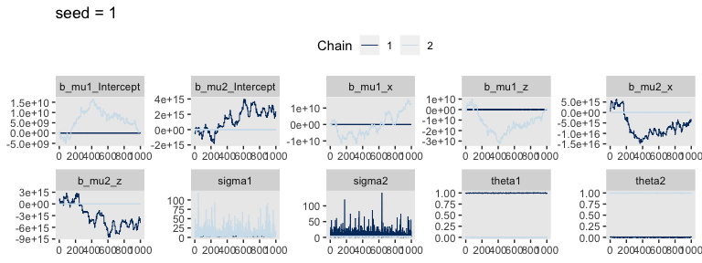
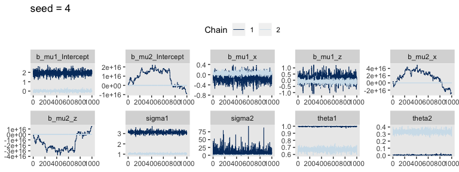
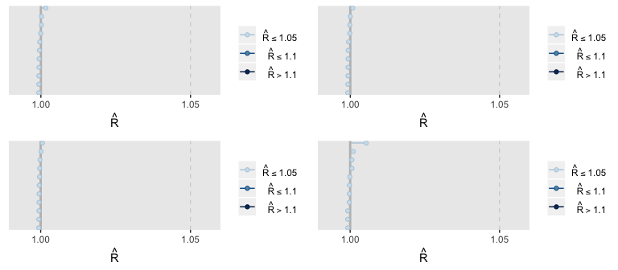
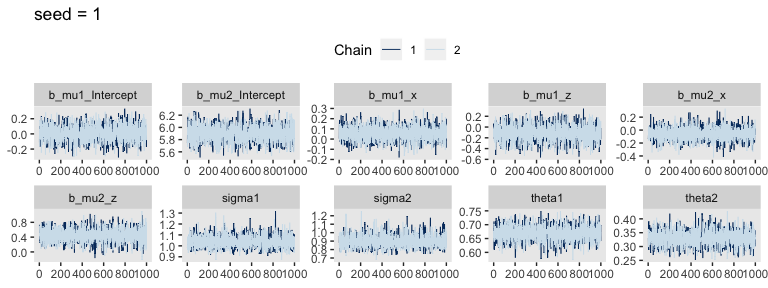
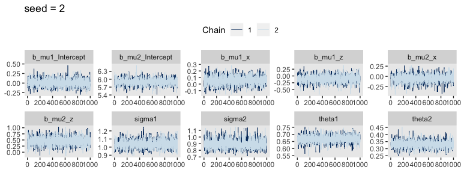
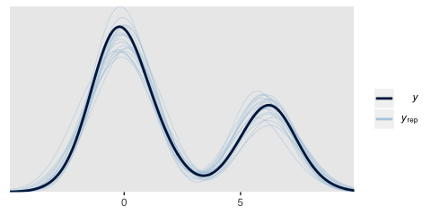

brms reference manual examples
================
A Solomon Kurz
2019-01-08

These are taken from the `mixture` section of the [brms reference manual](https://cran.r-project.org/web/packages/brms/brms.pdf).

We need data
------------

Here we simulate our data, `dat`.

``` r
library(tidyverse)

set.seed(1234)
dat <- 
  tibble(y = c(rnorm(200, mean = 0, sd = 1), 
               rnorm(100, mean = 6, sd = 1)),
         x = rnorm(300, mean = 0, sd = 1),
         z = sample(0:1, 300, replace = T))

head(dat)
```

    ## # A tibble: 6 x 3
    ##        y       x     z
    ##    <dbl>   <dbl> <int>
    ## 1 -1.21  -0.580      1
    ## 2  0.277 -0.953      0
    ## 3  1.08  -0.179      1
    ## 4 -2.35   1.01       0
    ## 5  0.429  0.0236     0
    ## 6  0.506 -0.649      1

Here's what the data look like.

``` r
library(GGally)
theme_set(theme_grey() +
            theme(panel.grid = element_blank()))

dat %>% 
  mutate(z = factor(z)) %>% 
  
  ggpairs()
```


`fit1`: A simple normal mixture model
-------------------------------------

Open brms.

``` r
library(brms)
```

### Initial attempt following the reference manual syntax

Fit the model.

``` r
fit1_s1 <- 
  brm(data = dat,
      family = mixture(gaussian, gaussian),
      bf(y ~ x + z),
      prior = c(prior(normal(0, 7), Intercept, dpar = mu1),
                prior(normal(5, 7), Intercept, dpar = mu2)), 
      iter = 2000, warmup = 1000, chains = 2, cores = 2,
      seed = 1)

fit1_s2 <-
  update(fit1_s1,
         seed = 2)

fit1_s3 <-
  update(fit1_s1,
         seed = 3)

fit1_s4 <-
  update(fit1_s1,
         seed = 4)
```

If you'd like to inspect all those chains, you can use the `plot()` funciton, as usual. Since we're working in bulk, it might make sense to condense our diagnostics to $\\hat R$ plots via the [bayesplot package](http://mc-stan.org/bayesplot/).

``` r
library(bayesplot)
library(gridExtra)

p1 <-
  rhat(fit1_s1) %>% 
  mcmc_rhat()

p2 <-
  rhat(fit1_s2) %>% 
  mcmc_rhat()

p3 <-
  rhat(fit1_s3) %>% 
  mcmc_rhat()

p4 <-
  rhat(fit1_s4) %>% 
  mcmc_rhat()

grid.arrange(p1, p2, p3, p4, ncol = 2)
```


Recall we like our $\\hat R$ values to hover around 1. For the models from each seed, those are just a disaster. Let's take a peek at the chains from just two of the fits to get a sense of the damage.

``` r
posterior_samples(fit1_s1, add_chain = T) %>% 
  select(-lp__, -iter) %>% 
  mcmc_trace(facet_args = list(ncol = 5)) +
  ggtitle("seed = 1") +
  theme(legend.position = "top")
```


``` r
posterior_samples(fit1_s4, add_chain = T) %>% 
  select(-lp__, -iter) %>% 
  mcmc_trace(facet_args = list(ncol = 5)) +
  ggtitle("seed = 4") +
  theme(legend.position = "top")
```


Where as many of the chains in `fit1_s1` appeared to wildly meander across the parameter space, The parallel chains in `fit1_s4` seemed to stabilize on alternative parameter spaces. I believe this is often called the label switching problem (e.g., see [here](http://stephenslab.uchicago.edu/assets/papers/Stephens2000b.pdf)). Either way, the resulting $\\hat R$ values were awful.

### Second attempt: Tighten up the priors

For our first attempt at fixing the issue, we might tighten up the priors. Of our three variables, two are standardized and the third is a dummy. It wouldn't be unreasonable to *σ* = 1 Gaussians on all intercepts, *β*s, and even the model *σ*s themselves.

``` r
fit1_s1 <- 
  brm(data = dat,
      family = mixture(gaussian, gaussian),
      bf(y ~ x + z),
      prior = c(prior(normal(0, 1), Intercept, dpar = mu1),
                prior(normal(5, 1), Intercept, dpar = mu2),
                prior(normal(0, 1), class = b, dpar = mu1),
                prior(normal(0, 1), class = b, dpar = mu2),
                prior(normal(0, 1), class = sigma1),
                prior(normal(0, 1), class = sigma2)), 
      iter = 2000, warmup = 1000, chains = 2, cores = 2,
      seed = 1)

fit1_s2 <-
  update(fit1_s1,
         seed = 2)

fit1_s3 <-
  update(fit1_s1,
         seed = 3)

fit1_s4 <-
  update(fit1_s1,
         seed = 4)
```

Check the $\\hat R$ values.

``` r
p1 <-
  rhat(fit1_s1) %>% 
  mcmc_rhat()

p2 <-
  rhat(fit1_s2) %>% 
  mcmc_rhat()

p3 <-
  rhat(fit1_s3) %>% 
  mcmc_rhat()

p4 <-
  rhat(fit1_s4) %>% 
  mcmc_rhat()

grid.arrange(p1, p2, p3, p4, ncol = 2)
```


They only look good for 1 on 4. Not very encouraging. Let's revisit the chains for `seed = 1` and now inspect the better-looing `seed = 2`.

``` r
posterior_samples(fit1_s1, add_chain = T) %>% 
  select(-lp__, -iter) %>% 
  mcmc_trace(facet_args = list(ncol = 5)) +
  ggtitle("seed = 1") +
  theme(legend.position = "top")
```


``` r
posterior_samples(fit1_s2, add_chain = T) %>% 
  select(-lp__, -iter) %>% 
  mcmc_trace(facet_args = list(ncol = 5)) +
  ggtitle("seed = 2") +
  theme(legend.position = "top")
```


Well, the chains for `seed = 1` aren’t wildly flailing across ridiculous areas of the parameter space anymore. But they show the same odd parallel behavior like those from `seed = 4` in our first attempt. At least the chains from `seed = 2` have given us hope. If we were lazy, we’d just go ahead and use those. But man, that seems like a risky workflow, to me. I’d like a more stable solution.

### Third attempt: `order = "mu"`

``` r
fit1_s1 <- 
  brm(data = dat,
      family = mixture(gaussian, gaussian, order = "mu"),
      bf(y ~ x + z),
      prior = c(prior(normal(0, 7), Intercept, dpar = mu1),
                prior(normal(5, 7), Intercept, dpar = mu2)), 
      iter = 2000, warmup = 1000, chains = 2, cores = 2,
      seed = 1)

fit1_s2 <-
  update(fit1_s1,
         seed = 2)

fit1_s3 <-
  update(fit1_s1,
         seed = 3)

fit1_s4 <-
  update(fit1_s1,
         seed = 4)
```

What do the $\\hat R$ values tell us?

``` r
p1 <-
  rhat(fit1_s1) %>% 
  mcmc_rhat()

p2 <-
  rhat(fit1_s2) %>% 
  mcmc_rhat()

p3 <-
  rhat(fit1_s3) %>% 
  mcmc_rhat()

p4 <-
  rhat(fit1_s4) %>% 
  mcmc_rhat()

grid.arrange(p1, p2, p3, p4, ncol = 2)
```


Nope, using `order = "mu"` didn't solve the problem. Let's confirm by looking at the chains.

``` r
posterior_samples(fit1_s1, add_chain = T) %>% 
  select(-lp__, -iter) %>% 
  mcmc_trace(facet_args = list(ncol = 5)) +
  ggtitle("seed = 1") +
  theme(legend.position = "top")
```



``` r
posterior_samples(fit1_s2, add_chain = T) %>% 
  select(-lp__, -iter) %>% 
  mcmc_trace(facet_args = list(ncol = 5)) +
  ggtitle("seed = 4") +
  theme(legend.position = "top")
```



### Fourth attempt: Add `order = "mu"` in addition to better priors

Here we combine `order = "mu"` to the models with the tighter priors from the second attempt.

``` r
fit1_s1 <- 
  brm(data = dat,
      family = mixture(gaussian, gaussian, order = "mu"),
      bf(y ~ x + z),
      prior = c(prior(normal(0, 1), Intercept, dpar = mu1),
                prior(normal(5, 1), Intercept, dpar = mu2),
                prior(normal(0, 1), class = b, dpar = mu1),
                prior(normal(0, 1), class = b, dpar = mu2),
                prior(normal(0, 1), class = sigma1),
                prior(normal(0, 1), class = sigma2)), 
      iter = 2000, warmup = 1000, chains = 2, cores = 2,
      seed = 1)

fit1_s2 <-
  update(fit1_s1,
         seed = 2)

fit1_s3 <-
  update(fit1_s1,
         seed = 3)

fit1_s4 <-
  update(fit1_s1,
         seed = 4)
```

How do the $\\hat R$ values look now?

``` r
p1 <-
  rhat(fit1_s1) %>% 
  mcmc_rhat()

p2 <-
  rhat(fit1_s2) %>% 
  mcmc_rhat()

p3 <-
  rhat(fit1_s3) %>% 
  mcmc_rhat()

p4 <-
  rhat(fit1_s4) %>% 
  mcmc_rhat()

grid.arrange(p1, p2, p3, p4, ncol = 2)
```


Still failed on 3/4. We need a better solution. Here are some of the chains.

``` r
posterior_samples(fit1_s1, add_chain = T) %>% 
  select(-lp__, -iter) %>% 
  mcmc_trace(facet_args = list(ncol = 5)) +
  ggtitle("seed = 1") +
  theme(legend.position = "top")
```


``` r
posterior_samples(fit1_s2, add_chain = T) %>% 
  select(-lp__, -iter) %>% 
  mcmc_trace(facet_args = list(ncol = 5)) +
  ggtitle("seed = 2") +
  theme(legend.position = "top")
```


The label switching persists.

### Fifth attempt: What if we tighten up the priors on those intercepts even more?

We'll reduce those Gaussian *σ*s to 0.5.

``` r
fit1_s1 <- 
  brm(data = dat,
      family = mixture(gaussian, gaussian, order = "mu"),
      bf(y ~ x + z),
      prior = c(prior(normal(0, .5), Intercept, dpar = mu1),
                prior(normal(5, .5), Intercept, dpar = mu2),
                prior(normal(0, 1), class = b, dpar = mu1),
                prior(normal(0, 1), class = b, dpar = mu2),
                prior(normal(0, 1), class = sigma1),
                prior(normal(0, 1), class = sigma2)), 
      iter = 2000, warmup = 1000, chains = 2, cores = 2,
      seed = 1)

fit1_s2 <-
  update(fit1_s1,
         seed = 2)

fit1_s3 <-
  update(fit1_s1,
         seed = 3)

fit1_s4 <-
  update(fit1_s1,
         seed = 4)
```

How do the $\\hat R$ values look now?

``` r
p1 <-
  rhat(fit1_s1) %>% 
  mcmc_rhat()

p2 <-
  rhat(fit1_s2) %>%
  mcmc_rhat()

p3 <-
  rhat(fit1_s3) %>% 
  mcmc_rhat()

p4 <-
  rhat(fit1_s4) %>% 
  mcmc_rhat()

grid.arrange(p1, p2, p3, p4, ncol = 2)
```



Success! I feel so whipped from the previous versions, let's just examine some of the chains to make sure it's all good.

``` r
posterior_samples(fit1_s1, add_chain = T) %>% 
  select(-lp__, -iter) %>% 
  mcmc_trace(facet_args = list(ncol = 5)) +
  ggtitle("seed = 1") +
  theme(legend.position = "top")
```



``` r
posterior_samples(fit1_s2, add_chain = T) %>% 
  select(-lp__, -iter) %>% 
  mcmc_trace(facet_args = list(ncol = 5)) +
  ggtitle("seed = 2") +
  theme(legend.position = "top")
```



Oh mamma. Those are some sweet chains. So we learned a lesson. One reasonably reliable solution to the label switching problem is if we hold the model's hand with tight priors on the intercept, or presumably the other parameters we expect substantial differences in. I'm definitely not entirely happy with this method. It seems heavier-handed than I prefer.

But anyways, let's look at the model summary.

``` r
print(fit1_s1)
```

    ##  Family: mixture(gaussian, gaussian) 
    ##   Links: mu1 = identity; sigma1 = identity; mu2 = identity; sigma2 = identity; theta1 = identity; theta2 = identity 
    ## Formula: y ~ x + z 
    ##    Data: dat (Number of observations: 300) 
    ## Samples: 2 chains, each with iter = 2000; warmup = 1000; thin = 1;
    ##          total post-warmup samples = 2000
    ## 
    ## Population-Level Effects: 
    ##               Estimate Est.Error l-95% CI u-95% CI Eff.Sample Rhat
    ## mu1_Intercept     0.01      0.10    -0.19     0.21       2579 1.00
    ## mu2_Intercept     5.90      0.13     5.64     6.14       3375 1.00
    ## mu1_x             0.06      0.07    -0.08     0.19       4026 1.00
    ## mu1_z            -0.11      0.15    -0.41     0.18       3825 1.00
    ## mu2_x            -0.06      0.10    -0.26     0.14       3119 1.00
    ## mu2_z             0.45      0.18     0.08     0.81       4103 1.00
    ## 
    ## Family Specific Parameters: 
    ##        Estimate Est.Error l-95% CI u-95% CI Eff.Sample Rhat
    ## sigma1     1.04      0.06     0.94     1.15       3234 1.00
    ## sigma2     0.90      0.07     0.77     1.06       2982 1.00
    ## theta1     0.67      0.03     0.61     0.72       3702 1.00
    ## theta2     0.33      0.03     0.28     0.39       3702 1.00
    ## 
    ## Samples were drawn using sampling(NUTS). For each parameter, Eff.Sample 
    ## is a crude measure of effective sample size, and Rhat is the potential 
    ## scale reduction factor on split chains (at convergence, Rhat = 1).

The parameter estimates look great. And yeah, it makes sense this was a difficult model to fit. It was only the intercepts that varied across the two classes. Everything else was basically the same.

Well, okay, those *θ* parameters differed. Which, by the way, leads one to nail down precisely what they are. They look a lot like proportions. If so, the *θ*s should always sum to 1. Let's see.

``` r
posterior_samples(fit1_s1) %>% 
  transmute(theta_sum = theta1 + theta2) %>% 
  range()
```

    ## [1] 1 1

Yep, they always sum to 1, consistent with a proportion interpretation. Based on the combination of the intercepts and *θ*s, the model is telling us the intercept was about 0 for 2/3 of the cases. We can confirm that's correct with a quick refresher at the simulation code:

``` r
dat <- 
  tibble(y = c(rnorm(200, mean = 0, sd = 1), 
               rnorm(100, mean = 6, sd = 1)),
         x = rnorm(300, mean = 0, sd = 1),
         z = sample(0:1, 300, replace = T))
```

Yep, for `y`, 200 of the total 300 cases were simulated based on the standard Gaussian.

Let's finish out the code from the reference manual and do a posterior predictive check.

``` r
pp_check(fit1_s1,
         nsamples = 20)
```



Looks great!

Session info
------------

``` r
sessionInfo()
```

    ## R version 3.5.1 (2018-07-02)
    ## Platform: x86_64-apple-darwin15.6.0 (64-bit)
    ## Running under: macOS High Sierra 10.13.6
    ## 
    ## Matrix products: default
    ## BLAS: /Library/Frameworks/R.framework/Versions/3.5/Resources/lib/libRblas.0.dylib
    ## LAPACK: /Library/Frameworks/R.framework/Versions/3.5/Resources/lib/libRlapack.dylib
    ## 
    ## locale:
    ## [1] en_US.UTF-8/en_US.UTF-8/en_US.UTF-8/C/en_US.UTF-8/en_US.UTF-8
    ## 
    ## attached base packages:
    ## [1] stats     graphics  grDevices utils     datasets  methods   base     
    ## 
    ## other attached packages:
    ##  [1] gridExtra_2.3   bayesplot_1.6.0 brms_2.7.0      Rcpp_1.0.0     
    ##  [5] bindrcpp_0.2.2  GGally_1.4.0    forcats_0.3.0   stringr_1.3.1  
    ##  [9] dplyr_0.7.6     purrr_0.2.5     readr_1.1.1     tidyr_0.8.1    
    ## [13] tibble_1.4.2    ggplot2_3.1.0   tidyverse_1.2.1
    ## 
    ## loaded via a namespace (and not attached):
    ##  [1] nlme_3.1-137         matrixStats_0.54.0   xts_0.10-2          
    ##  [4] lubridate_1.7.4      RColorBrewer_1.1-2   threejs_0.3.1       
    ##  [7] httr_1.3.1           rstan_2.18.2         rprojroot_1.3-2     
    ## [10] tools_3.5.1          backports_1.1.2      utf8_1.1.4          
    ## [13] R6_2.3.0             DT_0.4               lazyeval_0.2.1      
    ## [16] colorspace_1.3-2     withr_2.1.2          prettyunits_1.0.2   
    ## [19] processx_3.2.1       tidyselect_0.2.4     mnormt_1.5-5        
    ## [22] Brobdingnag_1.2-5    compiler_3.5.1       cli_1.0.1           
    ## [25] rvest_0.3.2          shinyjs_1.0          xml2_1.2.0          
    ## [28] labeling_0.3         colourpicker_1.0     scales_1.0.0        
    ## [31] dygraphs_1.1.1.5     mvtnorm_1.0-8        psych_1.8.4         
    ## [34] callr_3.1.0          ggridges_0.5.0       StanHeaders_2.18.0-1
    ## [37] digest_0.6.18        foreign_0.8-70       rmarkdown_1.10      
    ## [40] base64enc_0.1-3      pkgconfig_2.0.1      htmltools_0.3.6     
    ## [43] htmlwidgets_1.2      rlang_0.3.0.1        readxl_1.1.0        
    ## [46] rstudioapi_0.7       shiny_1.1.0          bindr_0.1.1         
    ## [49] zoo_1.8-2            jsonlite_1.5         crosstalk_1.0.0     
    ## [52] gtools_3.8.1         inline_0.3.15        magrittr_1.5        
    ## [55] loo_2.0.0            Matrix_1.2-14        munsell_0.5.0       
    ## [58] abind_1.4-5          stringi_1.2.3        yaml_2.1.19         
    ## [61] pkgbuild_1.0.2       plyr_1.8.4           grid_3.5.1          
    ## [64] parallel_3.5.1       promises_1.0.1       crayon_1.3.4        
    ## [67] miniUI_0.1.1.1       lattice_0.20-35      haven_1.1.2         
    ## [70] hms_0.4.2            ps_1.2.1             knitr_1.20          
    ## [73] pillar_1.2.3         igraph_1.2.1         markdown_0.8        
    ## [76] shinystan_2.5.0      stats4_3.5.1         reshape2_1.4.3      
    ## [79] rstantools_1.5.0     glue_1.3.0           evaluate_0.10.1     
    ## [82] modelr_0.1.2         httpuv_1.4.4.2       cellranger_1.1.0    
    ## [85] gtable_0.2.0         reshape_0.8.7        assertthat_0.2.0    
    ## [88] mime_0.5             xtable_1.8-2         broom_0.4.5         
    ## [91] coda_0.19-2          later_0.7.3          rsconnect_0.8.8     
    ## [94] shinythemes_1.1.1    bridgesampling_0.4-0
